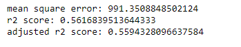
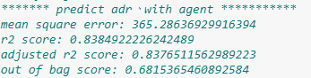
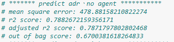
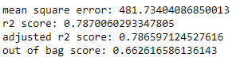
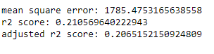
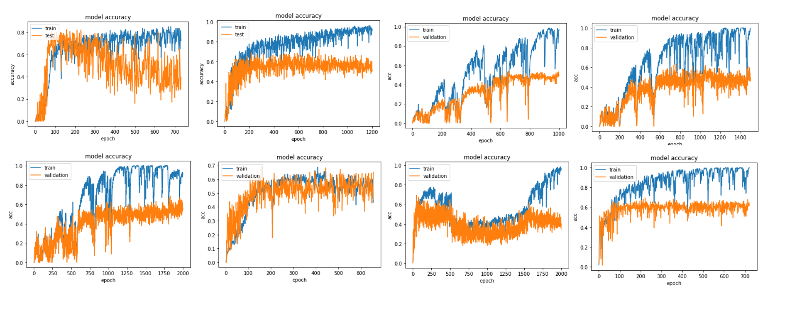
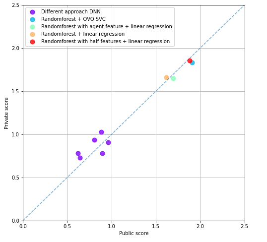

# ML predict arrival date total ADR
## Introduction
>根據訂房的資料，預測旅館每一日的總收入。使用的資料為經過處理的Kaggle Hotel booking demand dataset。輸入資料的格式為每一筆訂房的資料，其中包含入住日期、天數、成人人數、兒童人數等資料，輸出資料的格式為日期與當日的實際收入。
## Dataset
https://www.kaggle.com/jessemostipak/hotel-booking-demand
## Methods
### Preprocessing
>將每筆定單中Is canceled為 True同時deposit為No deposit的刪除，並將類別features如meal、hotel 等轉成one hot encoding，變成預測adr的資料集(70457,72)；預測 rank的資料則是將預測完的adr 依arrival date 合併，形成(640,1)的資料集。DNN的資料集則是先將類別features和日期換成one hot encodeing，再依arrival date合併，所以one hot encoding會變成量化資料，形成(640,158)的新資料。
### Machine learning
>models 有3種，預測 adr 和 rank的model及DNN，預測 adr用(91531, 33)大小的資料集預測出各訂單的 adr。預測rank的部分 用預測完的adr 依 arrival dates 合併成(640,1)去預測各arrival date 的 rank。
* 預測adr
    - Linear regression

        
    - Random Forest regression

        Random Forest regression保留agent feature

        

        Random Forest regression刪掉agent feature

        

        Random Forest regression保留agent feature 刪掉一半features

        

    - Adaboost regression

        
* 預測rank
    - Linear regression
        >Mean absolute error 為 0.1171875
    - One vs one svc classification
        >One vs one 的multi label svc classification，預測rank，用linear、rbf、polynomial、sigmoid等kernel，內部驗證後得出最好的model是用degree為3的ploynomial，C值為1000。
        Mean absolute error 為 0.125
    - One vs rest svc classification
        >One vs rest 的multi label svc classification，預測rank，但內部驗證沒OVO好。
        Mean absolute error 為 0.1953125
    - Random Forest regression
        >Random Forest 架構預測rank，並不是很好。
        Mean absolute error 為0.2265625

* DNN classification & regression

    利用DNN(Deep Neural Network)進行預測，利用regression為基礎，output則
只有一個，直接輸出實數日收入，再取最接近的整數rank作為最終預測。
我們總共實驗了8種不同架構和方法的深度網路模型。

    第一種方法，第一階段先用 DNN 訓練每筆訂單(共70457筆，72個 features)
預測出各訂單的 adr，再將訂單的 adr 依 arrival dates 合併，形成(640,1)的dataset；
第二階段用新的 dataset 餵入一般的 linear regression 去預測 arrival date 的 rank，因
為regression 是輸出實數，所以還須做後處理，將實數取 round 輸出 0-9 的label。

    第二種方法，如Preprocessing提到，直接將原本資料(大小為(91531,
33))處理成新的資料集(大小為(640,158))，並餵入 model 訓練輸出實數取 round 預
測 rank。Model 架構有以下幾種：

    - DNN_1：Input -> 512 -> 1024 -> 256 -> 1

        除了最後一層是 linear 輸出實數外，其他層都是 relu 當 activation
function，並跑3000次epoch，監督validation的mean absolute error，若500次epoch都
沒有進步則 early stop。
    - DNN_2：Input -> 316 -> 632 -> 1

        與其用2的指數當 layers node 數，不如用input size 的倍數。直接跑
1000次epoch。
    - DNN_3：Input -> 316 -> 632 -> 1

        與DNN_2相同，但跑1500次epoch。
    - DNN_4：Input -> 316 -> 632 -> 1

        與DNN_2相同，但跑2000次epoch。
    - DNN_5：Input -> 316 -> 632 -> 1264 -> 632 -> 1

        增加DNN_2的 layer 數，跑2000次epoch，並監督validation 的rank
accuracy，若500次沒有進步則early stop。
    - DNN_6：Input -> 316 -> 632 -> 1264 -> 632 -> 158 -> 1

        對稱式架構5層隱藏層，並跑2000次epoch。
    - DNN_7：Input -> 316 -> 632 -> 1264 -> 2528 -> 4992 -> 2528 -> 1264 -> 632
-> 158 -> 1

        對稱式架構9層隱藏層，並跑3000次epoch，監督validation 的rank
accuracy，若500次沒有進步則early stop。

    

## Results
我們選了三個approach做比較：

1. 先用Random Forest regression預測ADR，再用Linear regression輸出實數取round預測
2. rank先用Random Forest regression預測ADR，再用ovo SVC classification預測rank
3. 使用DNN直接預測實數值，取round作為預測的rank。

    以下針對不同方向來比較每個model的特性。

    訓練速度：

    因為DNN模型架構較複雜，所以它所需要的訓練時間相較於其他ML methods，像是Random Forest、Linear regression、SVM來說較費時。

    可解釋性：

    DNN因為利用到較高維度的feature transform，因此會使feature複雜化，而使整個模型的可解釋度下降。linear regression、SVM則利用相對線性的feature，因此可解釋度較高。Random Forest利用decision tree與bagging，可解釋度是最高的，方法本身利用的概念也最簡單。

    scalability：

    DNN因為整體的參數在每個epoch時同時更新，在訓練時若需要藉由分散式系統訓練，會花費較多的時間在交換數據，而因此無法完全平行化。若以分散式的方式投入更多運算資源，可能會比較快，但受限於amdahl’s law等原因無法達成線性加速。Random Forest在不同的decision tree之間的訓練是完全獨立的，因此訓練時能夠以分散式的方式依據運算資源的數量產生線性的加速，scalability極佳。

    準確度：

    在這個題目中，DNN表現最好，其中public score最好的是DNN_5，而privatescore最好的是DNN_7，因此我們最後選出的模型是DNN

    DNN之優缺點 :

    優點：準確度較高、有較多參數可以調整、模型較強

    缺點：可解釋性較差、訓練時間較久、網路架構只能用try and error優化

